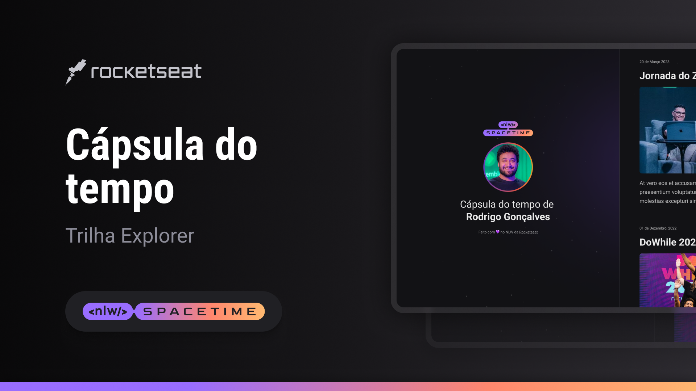

## 💻 Projeto
Esse é um projeto web responsivo, de uma cápsula do tempo em uma timeline.

## 🚀 Tecnologias
Esse projeto foi desenvolvido durante o NLW da Rocketseat com as seguintes tecnologias:

- html
- css
- git e github

## 🏷️ layout
Voçêpode visualizar o layout do projeto através de 
[desse link](https://www.figma.com/file/qUyMKCFJ8LskHNXIs12MEi/C%C3%A1psula-do-tempo-%E2%80%A2-Trilha-Explorer-(Community)?type=design&node-id=306%3A84&t=aaXbAsX9C9yfdNDv-1).
É necessário ter uma conta no [Figma](https://www.figma.com)